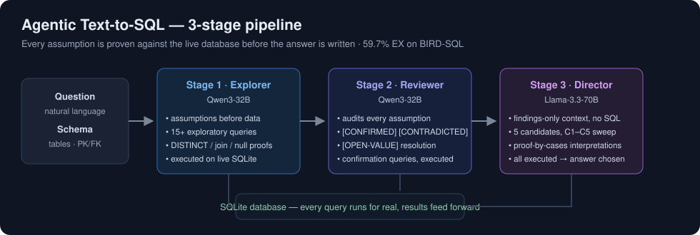

# 🔍 Agentic Text-to-SQL

**Ask a database a question in plain English — and watch a 3-stage agentic pipeline prove its way to the answer.**

Most text-to-SQL systems show an LLM the schema and hope. This one doesn't guess: it **explores the real database first**, verifies every assumption with actual SQL, and only then writes the answer — five candidate answers, in fact, each executed live.

> **59.7% execution accuracy on BIRD-SQL** with small open models (Qwen3-32B + Llama-3.3-70B) on free-tier inference — up from a 30.9% single-shot baseline with the same model class. The gain comes from the *method*, not model scale.

🚀 **[Try the live demo](https://huggingface.co/spaces/)** *(link goes live after deploy — see below)*



## How it works

The pipeline treats SQL generation as **hypothesis testing**, not autocomplete:

| Stage | Role | Model | What it does |
|---|---|---|---|
| **1 — Explorer** 🕵️ | junior analyst | Qwen3-32B | States assumptions *before* seeing data, then writes 15+ exploratory queries: `SELECT DISTINCT` probes on every filter value, join-key verification, null-count checks, scope proofs |
| **2 — Reviewer** 🧐 | same analyst, next day | Qwen3-32B | Audits every assumption against real query results — `[CONFIRMED]`, `[CONTRADICTED]`, `[OPEN-VALUE]`, `[LIKE-VS-ENUM]` — then writes targeted confirmation queries to close every gap |
| **3 — Director** 🎬 | senior reviewer | Llama-3.3-70B | Sees **findings only** (no SQL, no schema), writes 5 candidates spanning genuinely different interpretations of the question — the C1–C5 sweep — each executed against SQLite |

The design directly attacks the dominant failure mode in text-to-SQL: **schema hallucination** (filtering on values that don't exist, joining columns that don't connect). In our failure analysis it accounted for ~55% of addressable failures — and grounding every filter value in a `DISTINCT` probe is what suppresses it.

### Why five candidates?

The Director writes C1–C5 under a *proof-by-cases* principle: five structurally different readings of the question, so if the correct interpretation exists, at least one candidate captures it. On benchmark runs, candidates C2–C5 rescue ~10% of questions where C1 misses.

## Results

Evaluated on [BIRD-SQL](https://bird-bench.github.io/) (execution accuracy — predicted SQL must return the exact same rows as the gold SQL):

| Configuration | EX |
|---|---|
| Schema-only single shot (Llama-3.3-70B, best schema format) | 30.9% |
| + evidence hints — single-shot ceiling | 48.8% |
| **3-stage agentic pipeline (this repo's prompt stack)** | **59.7%** |

These numbers come from 12 documented research trials (500-question evaluations, per-trial failure analysis, strict train/dev contamination controls). Some hard-won engineering lessons are baked into this code:

- **Unnumbered-C1 recovery** — LLMs reliably emit the first candidate as raw SQL without its `1. --` prefix; a parser that misses it silently zeroes your C1 metrics *(this artifact invalidated an entire early finding before it was caught)*
- **Think-block stripping** for reasoning models
- **CTE ban in Stage 3** — cut syntax-error rate from 65% → 5%
- **Conditional LIMIT** — "always LIMIT" truncates list-type answers
- **Contrapositive filter test** — models love adding `status = 'Active'` filters nobody asked for
- **Execution deadlines via progress handler** — SQLite's connection timeout only bounds lock waits, not runaway queries

## Run it locally

```bash
git clone https://github.com/saadpolowork/agentic-text-to-sql
cd agentic-text-to-sql
pip install -r requirements.txt

export GROQ_API_KEY=your_free_key   # console.groq.com — free tier is enough
streamlit run app.py
```

Two BIRD dev databases are bundled: **superhero** (750 heroes, powers, publishers) and **california_schools** (17k schools, SAT scores, funding). Pick a curated benchmark question (scored against the official gold answer) or ask your own.

The **Example gallery** tab replays pre-computed runs instantly, no API key needed. Regenerate them with:

```bash
python scripts/generate_cache.py            # all sample questions
python scripts/generate_cache.py --db superhero --limit 3
```

### Swapping providers

Any OpenAI-compatible endpoint works via env vars:

```bash
export LLM_BASE_URL=http://localhost:11434/v1   # e.g. Ollama
export LLM_STAGE1_MODEL=gemma3:12b
export LLM_STAGE2_MODEL=gemma3:12b
export LLM_STAGE3_MODEL=gemma3:12b
```

## Deploy your own (free)

The demo runs on Hugging Face Spaces (free CPU tier — the LLM work happens on Groq, the Space only orchestrates):

1. Create a new Space at [huggingface.co/new-space](https://huggingface.co/new-space) → SDK: **Streamlit**
2. Push this repo to it (or use "Import from GitHub")
3. In Space **Settings → Variables and secrets**, add secret `GROQ_API_KEY`
4. Done — the Space builds and serves the app at a permanent public URL

## Repository layout

```
app.py                     Streamlit UI (live runs + cached gallery)
pipeline/
  prompts.py               The exact Trial-12 prompt stack (S1/S2/S3)
  runner.py                3-stage orchestration, trace assembly
  parsing.py               Query/candidate extraction (with the C1-recovery fix)
  executor.py              Safe read-only SQLite execution (deadline, LIMIT injection)
  schema.py                BIRD tables.json → annotated schema text
  llm.py                   OpenAI-compatible inference w/ 429 backoff
scripts/generate_cache.py  Pre-run sample questions → cached_traces/
data/                      2 bundled BIRD dev databases + curated questions
cached_traces/             Pre-computed runs for the instant gallery
```

## Data & license

Code: MIT. Bundled databases and questions are from the [BIRD-SQL benchmark](https://bird-bench.github.io/) (CC BY-SA 4.0) — © the BIRD authors, included here for demonstration.

---

Built by **Saad Tariq**. This is the public showcase of a longer research effort — 14 trials across 5 pipeline generations, with per-trial failure taxonomies and experiment write-ups. If you're working on text-to-SQL grounding, reliability of agentic pipelines, or eval integrity, I'm happy to talk.
